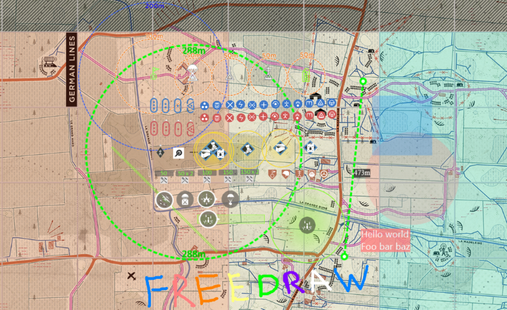

# Maps Let Loose

Quickly create advanced custom tacmaps for Hell Let Loose.

- https://mattw.io/maps-let-loose/

How can I use this tool?

- Plan out garrison locations with 200m radiuses visible
- See offensive default garrison locations to know where to attack
- See maximum artillery ranges and which last points you can and can't hit
- Measure distances for AT sniping
- Create rooms to edit tacmaps live with a group of people
- Strategize upcoming matches and scenarios with a wide variety of assets to add to the map
    - Garrisons, OPs, Airheads, Halftracks, Tanks, Trucks, AT Guns, Markers, Player classes, Repair stations, Nodes, Supplies, Commander abilities, Measurement tools, Shapes, Textboxes, and Drawings

What other features are there?

- Toggle all the strongpoints and their resource icons on and off
- Toggle the map grid on and off
- Toggle tanks and player classes blue and red to indicate friendly/enemy
- Save the map as a high quality 1920x1920 PNG
- Export your current map config as a zip file and reimport to work on it later
- Freely draw on the map in any color
- Some smaller elements will scale larger when zoomed out
- Mostly mobile-friendly so you can use it if you don't have a second monitor
- Rooms can be configured with a custom password or no password at all
- Rooms expire after 2 hours of inactivity, plenty to last the majority of matches

## Build

Refer to [BUILD.md](./BUILD.md)
for instructions on how to build and run from source.

## Contributing

Contributions are welcome, refer
to [CONTRIBUTING.md](./CONTRIBUTING.md)
for more detail.
